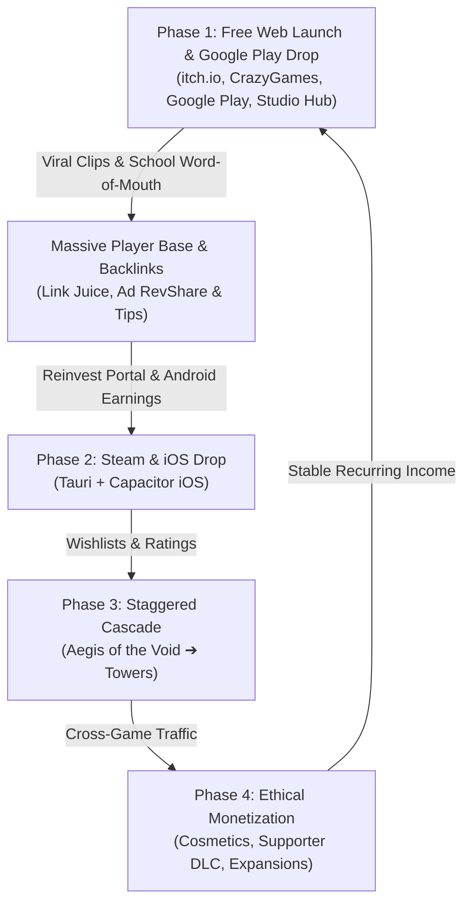

# Project Spears: 3-Year Master Game Launch, Link Juice & Revenue Playbook

This master strategy outlines the exact, step-by-step roadmap to launch **Cabled-In**, **Aegis of the Void**, and **Towers**, build an authoritative indie brand with high link juice, achieve viral reach, and create a sustainable, quality-first revenue stream over the next 3 years.

---

## Strategic Foundation: The Flywheel Overview



---

## Phase 1: Web & Google Play Dual-Pronged Ignition (Months 1 – 3)

### 1. Flagship Game Polish (*Cabled-In*)
* **Lead Title**: *Cabled-In* serves as the viral spearhead because its theme (chaotic data-center disaster, sliding cart physics, 30s explosion countdown, boss cable wrapping) is uniquely memeable and relatable to anyone who works with computers or enjoys high-stress arcade simulators.
* **Key Feature Leverage**: 
  * Highlight the new **Turbo Smooth Mode** so school laptops, Chromebooks, and low-spec PCs can run it at a locked 60 FPS without lag.
  * Implement **Capacitor Virtual Thumbstick & Drag Steering** with native Android haptics for buttery mobile drift mechanics.

### 2. Launch Distribution Channels (Low/Zero Upfront Cost)
| Platform | Cost | Role & Revenue Mechanism |
| :--- | :--- | :--- |
| **Google Play Store** | $25 *(one-time fee)* | Official Android app launch. Unlocks global store discovery, Google Play Games Leaderboards, and optional rewarded revive ads / cosmetic IAPs. |
| **CrazyGames** | $0 | Submit to Developer Portal. Revenue-share on non-intrusive pre-roll/rewarded ads (can yield $500–$5,000+/mo for viral hits). |
| **itch.io** | $0 | Community hub for indie purists. Enable "Name Your Own Price" / community tips (PayPal/Stripe). |
| **Newgrounds & Poki** | $0 | Dedicated community of browser gamers; frontpage features bring immediate organic spikes and linkbacks. |

### 3. Unified Studio Hub & Backlink Engine (`projectspears.com`)
* **Host Free**: Deploy on **Cloudflare Pages** or **GitHub Pages** (100% free, global CDN, instant HTTPS).
* **Direct Playable Embeds**: Allow players to play full-screen directly on your domain (`/cabled-in`) with direct links to *"Get it on Google Play"*.
* **High Link Juice SEO Setup**:
  * Implement `schema.org/VideoGame` JSON-LD metadata for rich Google search cards.
  * Add OpenGraph tags for Discord, Twitter/X, and Reddit link previews.
  * Embed a downloadable Press Kit (`/presskit`) with high-res PNG logos, gameplay GIFs, and developer story.
  * Provide an `<iframe>` embed code button (*"Embed this game on your site"*)—this is how unblocked school gaming portals and indie blogs create thousands of organic `.edu` and niche backlinks pointing directly to your domain.

---

## Phase 2: Steam & iOS Expansion (Months 4 – 8)

*Reinvest the initial revenue earned from Google Play and web portal ad-shares to fund remaining commercial accounts:*
* **Steam Direct Fee**: $100 (recoupable after $1,000 in gross revenue).
* **Apple Developer Program**: $99/year (added once Android + Web traction validates iOS player demand).

### Technical Packaging Toolchain
* **Android (Google Play)**:
  * Wrapped with **Capacitor.js** (`@capacitor/android`, `@capacitor/haptics`).
  * Generates signed `.aab` (Android App Bundle) targeting modern API levels.
  * Features immersive fullscreen, hardware-accelerated WebView, and phone rumble haptics during collisions and explosions.
* **Desktop (Steam - PC, Mac, Linux)**:
  * Wrapped using **Tauri** (Rust-based WebView).
  * Produces tiny ~10MB binaries (vs 120MB+ Electron), starts instantly, uses low memory, and integrates the native Steamworks API for Steam Achievements, Leaderboards, and Cloud Saves.
* **iOS (Apple App Store)**:
  * Exported via Capacitor's iOS bridge (`@capacitor/ios`) for iPad and iPhone.

---

## Phase 3: The 3-Game Staggered Cascade (Months 9 – 18)

Do not release all 3 games at once; stagger them by 2–3 months to maintain continuous PR momentum and cross-promote:

```
[Month 1-3]  Cabled-In (Web Launch & Google Play Drop) ➔ Build Audience & Link Juice
[Month 4-6]  Cabled-In (Steam + iOS Drop) + In-Game Cross-Promo Banners
[Month 7-9]  Aegis of the Void / Break the Loop (Omni-Channel Drop)
[Month 10-12] Towers / Mining (Omni-Channel Drop)
[Month 13+]  Unified "Project Spears Arcade Bundle" on Steam
```

### Cross-Pollination Engine
* Every game has a sleek, non-intrusive **"MORE GAMES FROM PROJECT SPEARS"** card on its main menu.
* Playing one game unlocks a free cosmetic cross-over skin in another (e.g., reaching DEFCON 1 in *Cabled-In* unlocks a "Data Center Cart" in *Aegis of the Void*).

---

## Phase 4: Ethical Monetization Architecture (Months 18 – 36)

> [!IMPORTANT]
> Zero Pay-To-Win Guarantee: Core gameplay, physics, and high-score ladders remain 100% free and uninhibited. Monetization focuses purely on vanity, prestige, and enthusiast appreciation.

### 1. Visual & Audio Cosmetics ($0.99 – $2.99)
* **Neon Cable Glow Trails**: Custom particle effects (Hyper-Cyan, Cyber-Magenta, Liquid Emerald).
* **Custom Cart Chassis**: Retro Hot-Rod Cart, Heavy Industrial Bulldozer, Quantum Hover-Puck.
* **Server Rack Skins**: 90s Beige CRT Tower racks, Alien Bioship Server hives.

### 2. "Supporter Edition" DLC / Tip Jar ($4.99 – $9.99)
* Digital Soundtrack (FLAC/MP3) featuring high-octane synthwave tracks.
* PDF Digital Artbook & Developer Commentaries.
* Exclusive in-game golden name badge in leaderboards.

### 3. "Director's Cut / Overtime" Expansion ($3.99 one-time)
* Endless Sandbox Customizer: adjust floor slipperiness, spawn rates, and physics sliders.
* Offline mode capability for laptops and flights.

---

## Optimal Marketing & Social Media Campaign Playbook

### 1. The TikTok / YouTube Shorts / Reels Chaos Formula
Short-form algorithms thrive on **high-stakes tension followed by immediate failure or clutch saves**.

#### Clip Structure (15–30 Seconds)
1. **The Hook (0–3s)**: On-screen text: *"My server is about to explode in 6 seconds and I'm sliding on butter."*
2. **The Chaos (3–15s)**: Fast drifting, bouncing off racks with elastic ricochets, frantically searching for the failing node as the countdown reaches `03... 02... 01...`
3. **The Payoff (15–20s)**:
   * *Variant A (The Clutch)*: Plugging in the cord with 0.2s left, massive emerald sparks emit, sigh of relief.
   * *Variant B (The Catastrophe)*: Ricocheting off a corner, missing the rack, and the server explodes violently into fire particles and screen shake.
4. **Call to Action (20–25s)**: *"Play free in your browser or on Google Play right now (link in bio)!"*

### 2. Reddit Grassroots Campaigns
* **Target Subreddits**:
  * `r/WebGames`: Submit direct playable link; browser gamers love clever mechanic twists.
  * `r/sysadmin` & `r/pcmasterrace`: Share relatable meme clips (*"I made a game about what being on-call as a network engineer actually feels like"*).
  * `r/IndieDev` & `r/gamedev`: Post technical breakdown devlogs (*"How I optimized an HTML5 Canvas game to hit locked 60 FPS on school Chromebooks"*).
  * `r/ShowHN` (Hacker News): Post a clean, technical showcase (*"Show HN: Cabled In – An arcade game about preventing data center cascade failures"*).

### 3. Retargeting Ad Strategy (When Budget Permits)
* Allocate **$5–$10/day** on TikTok Ads or Meta Gaming Ads using your best-performing organic short-form clip.
* Target: Fans of arcade simulators, IT professionals, indie gaming enthusiasts.

---

## Action Checklist: Next Immediate Steps

- [ ] **Step 1**: Register Google Play Developer Account ($25 one-time).
- [ ] **Step 2**: Register custom domain (e.g., `projectspears.com`).
- [ ] **Step 3**: Deploy the Project Spears landing page with direct browser playable links on Cloudflare Pages.
- [ ] **Step 4**: Create Developer profiles on [itch.io](https://itch.io) and [CrazyGames Developer Portal](https://developer.crazygames.com).
- [ ] **Step 5**: Record 5 short-form vertical gameplay clips (1080x1920) showcasing drift physics, 30s countdowns, and explosions.
- [ ] **Step 6**: Submit *Cabled-In* to CrazyGames, itch.io, and Google Play.
